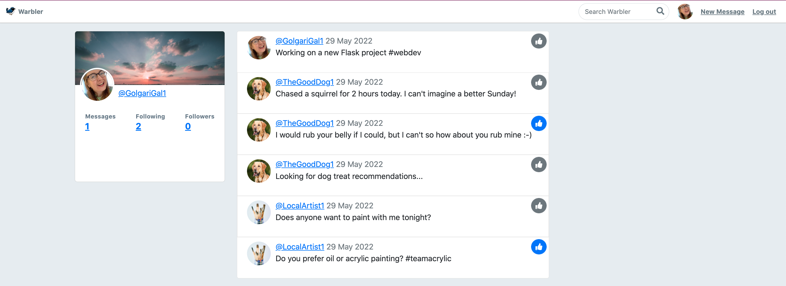

# Warbler - Part 2 - Kaitlin Berryman

## Part Two: Add Likes

**Do This Without AJAX/JavaScript**

Add a new feature that allows a user to “like” a warble. They should put a star (or some other similar symbol) next to liked warbles.

> I'm going to start with making a few users and some new messages


They should only be able to like warbles written by other users.

> ```
> # if it's the current user's own message, pass
> msg = Message.query.get(message_id)
>
> if msg.user_id == g.user.id:
>     return redirect('/')
>   ```

They should be able to unlike a warble, by clicking on that star.
> The like button turns blue when liked and gray when unliked

On a profile page, it should show how many warblers that user has liked, and this should link to a page showing their liked warbles.




```
@app.route('/users/add_like/<int:message_id>', methods=["GET", "POST"])
def add_like(message_id):
    """Add like to message"""

    # if it's the current user's own message, pass
    msg = Message.query.get(message_id)
    if msg.user_id == g.user.id:
        return redirect('/')

    user_likes = g.user.likes
    if msg in user_likes:
        g.user.likes = [like for like in user_likes if like != msg]
        print("LIKED")
    else:
        g.user.likes.append(msg)
        print("UNLIKED")

    db.session.commit()

    return redirect("/")
```

In `homepage` view func,
```
likes = [msg.id for msg in g.user.likes]

        return render_template('home.html', messages=messages, likes=likes)
```

and

```
@app.route('/users/<int:user_id>/likes')
def show_likes(user_id):
    if not g.user:
        flash("Access unauthorized.", "danger")
        return redirect("/")

    user = User.query.get_or_404(user_id)

    return render_template('users/likes.html', user=user, likes=user.likes)
```

and edit `details.html`
