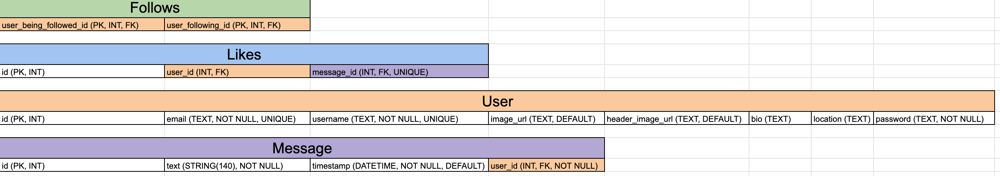
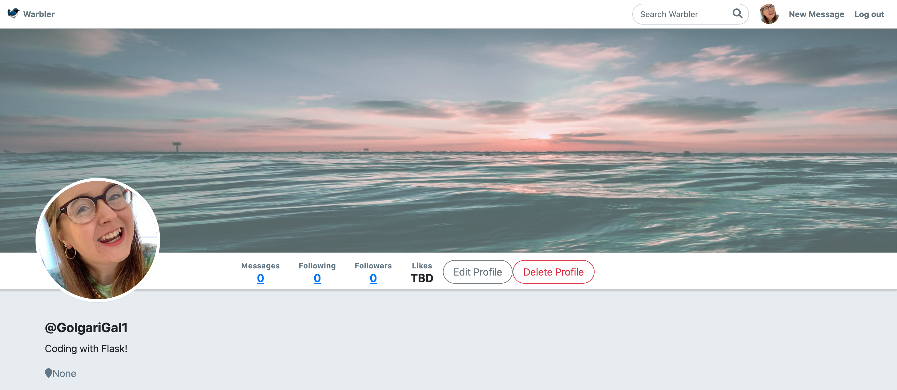
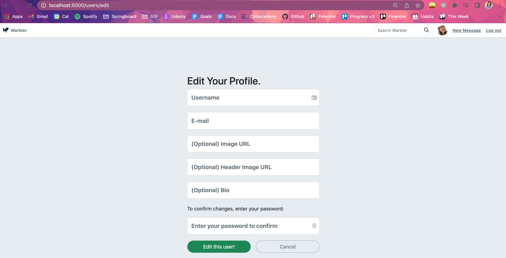

# Warbler
A Twitter clone with a Springboard spin!

## Setup

I set up my own project after being unable to resolve the install issues. I reached out to Springboard's on-demand TAs, but we couldn't figure out what was wrong.

---

### Creating a new Flask App

-   Create a new virtual environment in my directory  `python3 -m venv env`
-   Activate the virtual environment  `source env/bin/activate`
-   Install Flask  `pip3 install Flask`
-   Create  `flask/`  folder and  `app.py`  in there
-   Add boilerplate code

```
"""test Flask with this"""

from flask import Flask
app = Flask(__name__)

@app.route('/')
def hello():
    return 'Hello World!'

```

-   `cd flask`
-   `flask run`  to run this locally on localhost:5000

---

### Setting up git & GitHub

`git init`  `git status`  Create a  `.gitignore`  and include  `env/`  `git add .`  `git commit -m "Initial commit"`

Create a new repo on GitHub  `https://github.com/k-berryman/MyWarbler.git`  `git remote -v`  `git push origin master`

---

### Add WTForms

(with help from  [these instructions](https://python-adv-web-apps.readthedocs.io/en/latest/flask_forms.html))

-   `pip3 install Flask-WTF`
-   `pip3 install flask-wtf`  just to double check
-   Create  `forms.py`
-   Add the following imports in  `forms.py`

```
from flask_wtf import FlaskForm
from wtforms import FloatField, StringField
```

-   Configuring our form with the following

```
class AddForm(FlaskForm):
    """Form"""

    name = StringField("Snack Name")
    price = FloatField("Price in USD")
```

-   In  `app.py`,  `from forms import AddForm`
-   Start by rendering the form to the user which can be submitted via POST req
-   In  `app.py`
```
@app.route('/')
def home():
    form = AddForm()
    return render_template("index.html", form=form)
```

-   Create  `templates/index.html` on the same level as app.py
-   In  `index.html`,

```
<body>
  <h1>My Form</h1>
  <form action="" method="POST">
    
      <p>
        {{ field.label }}
        {{ field }}
      </p>
    
    <button>Submit</button>
  </form>
</body>
```
-   Update the route  `methods=["GET", "POST"]`  in  `app.py`
-
Now let's handle CSRF security This part `if field.widget.input_type != 'hidden'` filters out CSRF Token in display

In  `index.html`  At the top of the form add  `{{ form.hidden_tag() }} <!-- add type=hidden form fields -->`  Make sure it's part of the form because we want it to be included in our POST req

Now we need to validate that token on the serverside. In  `app.py`,

```
@app.route('/form', methods=["GET", "POST"])
def form():
    form = AddForm()

    # if it's a post request with a valid CSRF Token
    if form.validate_on_submit():
        return redirect('/answer')

    else:
        return render_template("index.html", form=form)

```

Make sure to test with data for it to work properly

`validate_on_submit`  takes an empty form and fills it with data from the request
```
 # if it's a post request with a valid CSRF Token
    if form.validate_on_submit():
        name = form.name.data
        price = form.price.data
        print(name, price)
        return redirect('/answer')
```
Now we have the data!

Time to validate the data -- Throw friendly errors if it doesn't match ideal data format In  `forms.py`,  `from wtforms.validators import InputRequired, Optional, Email`

```
class AddForm(FlaskForm):
    """Form"""
    name = StringField(
      "Snack Name",
      validators=[InputRequired()])
    price = FloatField(
      "Price in USD",
      validators=[InputRequired()])
    quantity = FloatField(
      "Amount of Snack",
      validators=[InputRequired()])

```

`validate _on_submit`  in  `app.py`  handles validating this

We want some error messages to render In  `index.html`, in form,

```
      <p>
        {{ field.label }}
        {{ field }}

        {}
          {{err}}
        {}
      </p>
```

A secret key is required to use CSRF. In  `app.py`,

```
# Flask-WTF requires an encryption key - the string can be anything
app.config['SECRET_KEY'] = 'TESTINGGG'
```

This is what  `index.html`  should contain

```
<!DOCTYPE html>
<html lang="en">
<head>
  <meta charset="UTF-8">
  <title>Form</title>
</head>
<body>
  <h1>My Form</h1>
  <form method="POST">
    {{ form.hidden_tag() }} <!-- add type=hidden form fields -->
    {{ form.csrf_token }}

    
      <p>
        {{ field.label }}
        {{ field }}

        
          {{ err }}
        
      </p>
    
    <button>Submit</button>
  </form>
</body>
</html>

```

Yay! WTForms is set up. Right now the values are from my last project, so we'll just update based on what input we need.

---

### Template Inheritance

-   Make  `templates`  folder and  `base.html`  in there and add this boilerplate

```
<!DOCTYPE html>
<html lang="en">
<head>
  <meta charset="UTF-8">
  <meta name="viewport" content="width=device-width, initial-scale=1.0">
  <meta http-equiv="X-UA-Compatible" content="ie=edge">
  <title>Document</title>
  <link rel="stylesheet" href="https://stackpath.bootstrapcdn.com/bootswatch/4.1.3/lumen/bootstrap.css">
</head>
<body>
  <div class="container">
    
    
  </div>
</body>
</html>
```

Create  `home.html`  with this boilerplate

```




<h1>Home Page</h1>
<h2>Hello, user!</h2>


```

In  `app.py`, import  `render_template`  and  `return render_template("home.html")`

---

Base app is now set up

---

Now let's go back to the start code to see if we can combine these apps
createdb kaitlinwarbler

---

## Part One: Fix Current Features

### Step One: Understand the Model

Read  `models.py`. Make a diagram of the four tables.


Note `that` the  follows  table has an unusual arrangement: it has two foreign keys to the same table. Why?
> There are two distinct users participating in the activity of "following" -- the follower & the followee -- we need both

`ipython3`, `%run app.py`, `db.create_all()`

### Step Two: Fix Logout

Right now, there are links in the site to logout, but the logout route is not implemented.
On logout, it should flash a success message and redirect to the login page.

```
@app.route('/logout')
def logout():
    """Handle logout of user."""
    session.clear()
    flash('Goodbye! Logging out now..')
    return redirect('/')
```

### Step Three: Fix User Profile

The profile page for users works, but is missing a few things:
-   the location
> `{{ user.location }}`
-   the bio
> `{{ user.bio }}`
-   the header image (which should be a background at the top)
> ``

Added these in `detail.html` 👍

### Step Four: Fix User Cards

On the followers, following, and list-users pages, the user cards need to show the bio for the users. Add this.
Added `{{ user.bio }}` in `followers.html`, `following.html`, and `index.html`

### Step Five: Profile Edit

There are buttons throughout the site for editing your profile, but this is unimplemented.

-   It should ensure a user is logged on (you can see how this is done in other routes)
-   It should show a form with the following:
    -   username
    -   email
    -   image_url
    -   header_image_url
    -   bio
    -   password  _[see below]_
-   It should check that that password is the valid password for the user—if not, it should flash an error and return to the homepage.
-   It should edit the user for all of these fields  _except_  password (ie, this is not an area where users can change their passwords–the password is only for checking if it is the current correct password.
-   On success, it should redirect to the user detail page.

Create `EditUserForm` in `forms.py`
```
class EditUserForm(FlaskForm):
    """Edit User form."""

    username = StringField('Username', validators=[DataRequired()])
    email = StringField('E-mail', validators=[DataRequired(), Email()])
    image_url = StringField('(Optional) Image URL')
    header_image_url = StringField('(Optional) Header Image URL')
    bio = StringField('(Optional) Bio')
    password = PasswordField('Password', validators=[Length(min=6)])
```

Create `edit_user`in `app.py`
```
@app.route('/users/edit', methods=["GET","POST"])
def edit_user():
    """Edit user."""

    # ensure a user is logged on
    if not g.user:
        flash("Access unauthorized.", "danger")
        return redirect("/")

    # show a form with the following: username, email, image_url, header_image_url, bio, password
    form = EditUserForm()

    # retrieve user info
    user_id = session[CURR_USER_KEY]
    user = User.query.filter_by(id=user_id).first()

    if form.validate_on_submit():
        try:
            # check that that password is the valid password for the user
            user = User.authenticate(
                username=user.username,
                password=form.password.data,
            )

        # if not, it should flash an error and return to the homepage.
        except:
            flash("Cannot authenticate user", 'danger')
            return redirect("/")

        # check is user has no value
        if user == False:
            flash("Cannot authenticate user", 'danger')
            return redirect("/")

        # edit the user for all of these fields except password
        user.username = form.username.data
        user.email = form.email.data
        user.image_url = form.image_url.data
        user.header_image_url = form.header_image_url.data
        user.bio = form.bio.data

        db.session.commit()

        # on success, redirect to the user detail page
        return redirect('/users/profile')

    else:
        return render_template("/users/edit.html", form=form)
```

Now connect the "Edit Profile" button to `/users/edit`



